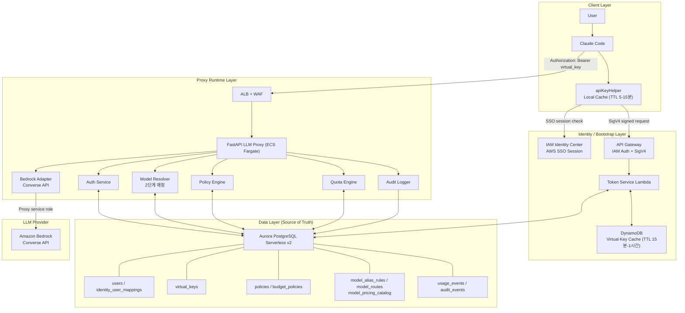
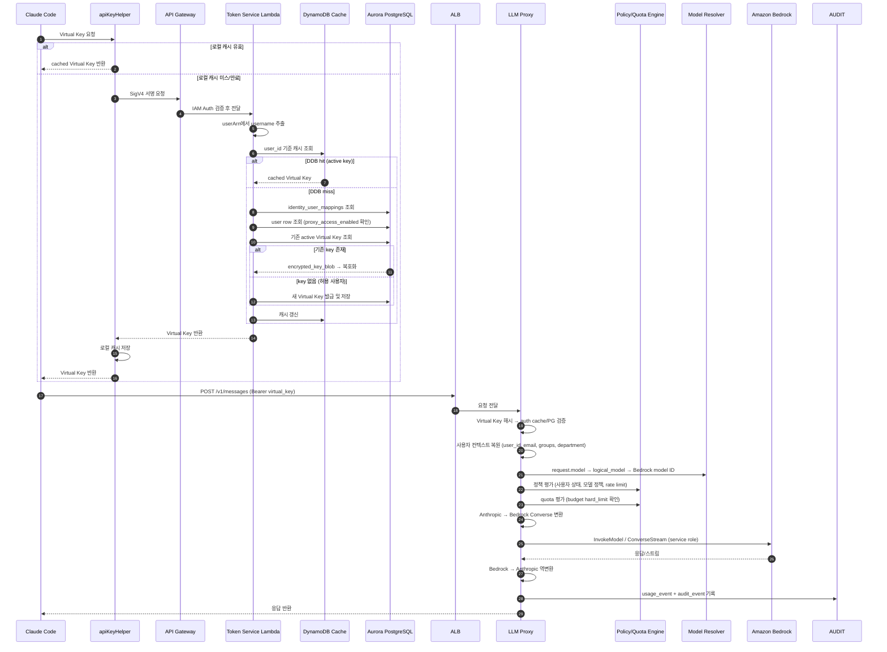
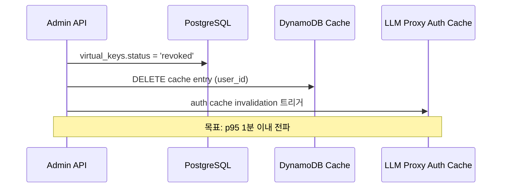
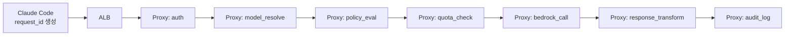

# Design Document: Claude Code Proxy

## 개요 (Overview)

Claude Code Proxy는 조직의 SSO 기반 인증을 통해 Claude Code 사용자를 식별하고, Virtual Key를 매개로 중앙 LLM Proxy를 통해 Amazon Bedrock를 호출하는 시스템이다.

시스템은 크게 네 계층으로 구성된다:

1. **Client Layer**: `apiKeyHelper` 스크립트가 SSO 세션을 기반으로 Virtual Key를 자동 획득하고 로컬 캐시에 저장
2. **Identity/Bootstrap Layer**: API Gateway(IAM Auth + SigV4) + Token Service Lambda가 조직 SSO 사용자를 검증하고 Virtual Key를 조회/발급
3. **Proxy Runtime Layer**: FastAPI 기반 LLM Proxy(ECS Fargate)가 ALB 뒤에서 Virtual Key 검증, 정책 평가, 모델 매핑, Bedrock 호출을 수행
4. **Data Layer**: Aurora PostgreSQL Serverless v2(source of truth) + DynamoDB(cache)

핵심 설계 원칙:
- Identity Center는 조직 사용자 여부를 검증한다
- Virtual Key는 Proxy 사용 권한을 검증한다
- DynamoDB는 cache이고 PostgreSQL은 source of truth다
- `cache miss → PostgreSQL user lookup → 기존 key 조회 → 필요 시에만 발급 → DDB 갱신`
- Bedrock 호출 권한은 Proxy 서비스 역할에만 부여한다

## 아키텍처 (Architecture)

### 전체 시스템 아키텍처



### 요청 처리 시퀀스



## 컴포넌트 및 인터페이스 (Components and Interfaces)

### 1. Client Layer

#### apiKeyHelper 스크립트

Claude Code의 `apiKeyHelper` 설정을 통해 호출되는 셸 스크립트로, Virtual Key 획득을 자동화한다.

**책임:**
- 로컬 캐시(TTL 5-15분) 확인 및 유효한 Virtual Key 즉시 반환
- SSO 세션 확인 및 필요 시 `aws sso login` 유도
- `aws configure export-credentials`로 SSO 임시 자격증명 export
- Token Service endpoint를 SigV4 서명으로 호출
- 반환된 Virtual Key를 로컬 캐시에 저장
- 연결 실패 시 명확한 오류 메시지 출력

**인터페이스:**
- 입력: Claude Code가 실행 시 자동 호출
- 출력: stdout으로 Virtual Key 문자열 반환
- 캐시 저장소: `~/.claude-code-proxy/cache.json` (TTL 포함)

### 2. Identity/Bootstrap Layer

#### Token Service API Gateway

- 인증 방식: IAM Auth (SigV4)
- Rate limiting 및 burst control 지원
- WAF 연동 가능
- TLS termination
- 모든 요청에 request ID 부여

#### Token Service Lambda

**책임:**
- `requestContext.identity.userArn`에서 username 추출
- `identity_user_mappings` 테이블에서 `user_id` 조회
- DynamoDB 캐시 조회 → PostgreSQL 원장 조회 → Virtual Key 반환/발급
- 미등록/비허용 사용자 요청 거부

**인터페이스:**

```
POST /token-service/get-or-create-key

Request: (API Gateway IAM Auth로 인증, body 없음)
Response:
{
  "virtual_key": "vk_xxxxxxxxxxxxxxxx",
  "expires_at": "2026-04-01T00:00:00Z",  // optional
  "user_id": "identity-center-user-id"
}

Error Responses:
- 401: 인증 실패 (유효하지 않은 SigV4 서명)
- 403: 사용자 미등록 또는 proxy_access_enabled=false
- 500: 내부 오류
```

### 3. Proxy Runtime Layer

#### FastAPI LLM Proxy (ECS Fargate)

ALB 뒤에서 동작하는 메인 프록시 서비스. 내부에 다음 컴포넌트를 포함한다.

##### Auth Service

**책임:**
- `Authorization: Bearer <virtual_key>` 헤더에서 Virtual Key 추출
- Virtual Key를 SHA-256 해시하여 PostgreSQL `virtual_keys.key_hash` 또는 auth cache에서 검증
- 검증 성공 시 `user_id`, `email`, `groups`, `department` 포함 사용자 컨텍스트 복원
- 클라이언트가 임의로 추가한 `X-User-*` 헤더, body 내 사용자 정보 무시
- auth cache TTL: 30-60초

##### Model Resolver (2단계 매핑)

**책임:**
- 1단계: `request.model` → `logical_model` (model_alias_rules 테이블 기반, 패턴 매칭)
  - 예: `claude-sonnet-4-20250514` → `sonnet`
- 2단계: `logical_model` → Bedrock model ID (model_routes 테이블 기반)
  - 예: `sonnet` → `us.anthropic.claude-sonnet-4-20250514-v1:0`
- Bedrock cross-region inference profile을 기본 target으로 사용 가능
- 매핑 결과를 메모리 캐시에 보관, Admin API CRUD 시 자동 reload

##### Policy Engine

**책임:**
- 정책 평가 순서: 사용자 상태 확인 → 모델 정책 평가 → rate limit 평가
- 모델 정책 scope 우선순위: user → group → department → global default
- 충돌 해결: deny > allow, 가장 보수적인 값 적용
- groups/department 누락 시 보수적 동작
- 요청 크기, 최대 출력 토큰, 허용 기능 제한

##### Quota Engine

**책임:**
- budget/quota 평가 순서: 사용자 단위 → 팀 단위 → 전역 default
- `hard_limit` 초과 시 Bedrock 호출 전 요청 차단
- `soft_limit`는 운영 설정값으로 저장/조회만 (현재 런타임 차단 미사용)
- metric 지원: `tokens`, `cost_usd`
- 비용 산정: `model_pricing_catalog`의 요청 시점 단가 snapshot 사용
- 여러 팀 policy 적용 시 가장 보수적인 정책 적용

##### Bedrock Adapter

**책임:**
- Anthropic 호환 inbound 요청 → Bedrock Converse API 형식 변환
- Bedrock 응답 → Anthropic 호환 response 또는 SSE stream 역변환
- Proxy 서비스 역할 자격증명으로만 Bedrock 호출
- streaming 응답 지원 (ConverseStream)

##### Audit Logger

**책임:**
- 모든 요청에 고유 `request_id` 부여
- `usage_events` 기록: user_id, model, tokens, cost estimate, latency, decision
- `audit_events` 기록: auth_success/failure, policy_denied, quota_hard_limit_blocked 등
- 프롬프트 원문 미저장 (최소 메타데이터만)
- 변경 불가능한 저장소 또는 중앙 로그 시스템으로 전달

### 4. Admin API

운영자가 사용자, 팀, 정책, 모델 매핑, Virtual Key를 관리하는 API. Public runtime API와 분리된 보호 경로에서 제공.

**주요 엔드포인트 그룹:**

| 그룹 | 엔드포인트 예시 | 설명 |
|------|----------------|------|
| 사용자 관리 | `POST/GET/PUT /admin/users`, `POST /admin/users/{user_id}/enable-proxy`, `POST /admin/users/{user_id}/disable-proxy` | 등록, 조회, 수정, Proxy 접근 활성화/비활성화 |
| 팀 관리 | `POST/GET/PUT /admin/teams`, `POST /admin/teams/{team_id}/enable`, `POST /admin/teams/{team_id}/disable` | 생성, 조회, 수정, 활성화/비활성화 |
| 팀 멤버십 | `GET/POST/DELETE /admin/teams/{team_id}/members`, `GET /admin/users/{user_id}/teams` | 멤버 조회, 추가, 제거, 사용자 기준 팀 목록 조회 |
| Virtual Key | `GET /admin/users/{user_id}/virtual-keys`, `POST /admin/users/{user_id}/virtual-keys/reissue`, `POST /admin/virtual-keys/{key_id}/rotate\|revoke\|disable\|enable` | 키 조회, 재발급, 회전, 폐기, 비활성화/활성화 |
| Budget 정책 | `GET/POST/PUT/DELETE /admin/users/{user_id}/budget-policies`, `GET/POST/PUT/DELETE /admin/teams/{team_id}/budget-policies`, `GET/POST/PUT/DELETE /admin/global/budget-policies` | 사용자/팀/전역 default budget 정책 관리 |
| 모델 매핑 | `GET/POST/PUT/DELETE /admin/model-alias-rules`, `GET/POST/PUT/DELETE /admin/model-routes`, `POST /admin/model-resolver/reload` | alias rule, route, resolver reload 관리 |
| 운영 조회 | `GET /admin/usage`, `GET /admin/audit-events` | 사용량, 감사 이벤트 조회 |

**인증:** 조직 SSO 기반 admin identity, 별도 admin role 또는 allowlist로 제한

### 5. Internal Operations API

운영 자동화나 강제 cache invalidation에 사용하는 내부 경로. 외부 사용자용 API와 분리된 네트워크 경계에서만 노출한다.

| 엔드포인트 | 메서드 | 설명 |
|-----------|--------|------|
| `/internal/cache/invalidate` | POST | Token Service/DDB cache 무효화 |
| `/internal/policy-cache/invalidate` | POST | Proxy 정책 및 auth cache 무효화 |
| `/internal/status` | GET | 내부 의존성 및 cache 상태 점검 |

초기 구현에서는 짧은 TTL cache만으로 운영할 수 있으며, Internal Operations API는 운영 자동화 필요 시 활성화한다.

### 6. Public Runtime API

Claude Code가 직접 호출하는 엔드포인트:

| 엔드포인트 | 메서드 | 설명 |
|-----------|--------|------|
| `/v1/messages` | POST | 추론 요청 (Anthropic 호환) |
| `/v1/messages/count_tokens` | POST | 토큰 카운팅 |
| `/health` | GET | Liveness probe |
| `/ready` | GET | Readiness probe (DB, resolver, dependency 상태) |

## 데이터 모델 (Data Models)

### Aurora PostgreSQL Serverless v2 스키마

#### users

시스템의 사용자 원장. `id`는 IAM Identity Center의 stable `UserId`와 동일한 값을 사용한다.

| 컬럼 | 타입 | 설명 |
|------|------|------|
| id | VARCHAR(128) PK | Identity Center UserId |
| email | VARCHAR(255) UNIQUE | 사용자 이메일 |
| display_name | VARCHAR(255) | 표시 이름 |
| department | VARCHAR(128) | 부서 |
| cost_center | VARCHAR(64) | 비용 센터 |
| groups | TEXT[] | 소속 그룹 목록 |
| employment_status | VARCHAR(32) | 재직 상태 (active, inactive) |
| proxy_access_enabled | BOOLEAN DEFAULT true | Proxy 사용 허용 여부 |
| created_at | TIMESTAMPTZ | 생성 시각 |
| updated_at | TIMESTAMPTZ | 수정 시각 |

#### identity_user_mappings

Token Service가 `userArn`에서 추출한 username을 `user_id`로 해석하기 위한 매핑 테이블.

| 컬럼 | 타입 | 설명 |
|------|------|------|
| id | SERIAL PK | 자동 증가 ID |
| username | VARCHAR(255) UNIQUE | ARN에서 추출한 username |
| user_id | VARCHAR(128) FK → users.id | 매핑된 user_id |
| identity_provider | VARCHAR(64) | 제공자 (예: identity-center) |
| created_at | TIMESTAMPTZ | 생성 시각 |

#### virtual_keys

Virtual Key 원장. 평문 key는 저장하지 않고 `key_hash`와 `encrypted_key_blob`를 저장한다.

| 컬럼 | 타입 | 설명 |
|------|------|------|
| id | UUID PK | Virtual Key ID |
| key_hash | VARCHAR(64) UNIQUE | SHA-256 해시 (Proxy 검증용) |
| encrypted_key_blob | BYTEA | 암호화된 원본 키 (Token Service 재사용용) |
| key_prefix | VARCHAR(16) | 키 접두사 (운영 식별용, 예: vk_xxxx) |
| user_id | VARCHAR(128) FK → users.id | 소유 사용자 |
| status | VARCHAR(16) | active, disabled, revoked |
| created_at | TIMESTAMPTZ | 생성 시각 |
| expires_at | TIMESTAMPTZ NULL | 만료 시각 (NULL이면 장수명) |
| rotated_at | TIMESTAMPTZ NULL | 마지막 rotation 시각 |
| revoked_at | TIMESTAMPTZ NULL | revoke 시각 |
| last_used_at | TIMESTAMPTZ NULL | 마지막 사용 시각 |

#### teams

Proxy 운영자가 관리하는 내부 팀 그룹핑.

| 컬럼 | 타입 | 설명 |
|------|------|------|
| id | UUID PK | 팀 ID |
| team_name | VARCHAR(255) | 팀 이름 |
| team_key | VARCHAR(128) UNIQUE | 팀 식별 키 (slug) |
| description | TEXT | 설명 |
| status | VARCHAR(16) | active, inactive |
| cost_center | VARCHAR(64) | 비용 센터 |
| department | VARCHAR(128) | 부서 |
| created_at | TIMESTAMPTZ | 생성 시각 |
| updated_at | TIMESTAMPTZ | 수정 시각 |

#### team_memberships

사용자-팀 매핑. 한 사용자가 여러 팀에 속할 수 있다.

| 컬럼 | 타입 | 설명 |
|------|------|------|
| team_id | UUID FK → teams.id | 팀 ID |
| user_id | VARCHAR(128) FK → users.id | 사용자 ID |
| role | VARCHAR(32) | member, manager, owner |
| joined_at | TIMESTAMPTZ | 가입 시각 |
| status | VARCHAR(16) | active, inactive |
| PRIMARY KEY | (team_id, user_id) | 복합 PK |

#### policies

사용자/그룹/부서/전역 단위 모델 접근 및 요청 제한 정책.

| 컬럼 | 타입 | 설명 |
|------|------|------|
| id | UUID PK | 정책 ID |
| scope_type | VARCHAR(16) | user, group, department, global |
| scope_value | VARCHAR(255) | scope 대상 값 (user_id, group명 등) |
| allowed_models | TEXT[] | 허용 모델 목록 |
| denied_models | TEXT[] | 금지 모델 목록 |
| max_tokens_per_request | INTEGER NULL | 요청당 최대 토큰 |
| daily_token_limit | BIGINT NULL | 일간 토큰 한도 |
| monthly_token_limit | BIGINT NULL | 월간 토큰 한도 |
| rate_limit_per_minute | INTEGER NULL | 분당 요청 제한 |
| enforcement_mode | VARCHAR(16) | enforce, audit_only |
| is_active | BOOLEAN DEFAULT true | 활성 여부 |
| created_at | TIMESTAMPTZ | 생성 시각 |
| updated_at | TIMESTAMPTZ | 수정 시각 |

#### budget_policies

사용자/팀/전역 단위 budget 정책. `soft_limit`는 운영 설정값, `hard_limit`는 실제 차단 기준.

| 컬럼 | 타입 | 설명 |
|------|------|------|
| id | UUID PK | Budget 정책 ID |
| scope_type | VARCHAR(16) | user, team, global |
| scope_value | VARCHAR(255) | scope 대상 값 |
| period_type | VARCHAR(8) | day, month |
| metric_type | VARCHAR(16) | tokens, cost_usd |
| limit_value | NUMERIC(18,4) | 한도 값 |
| soft_limit_percent | INTEGER | soft limit 퍼센트 (운영 설정값) |
| hard_limit_percent | INTEGER | hard limit 퍼센트 (차단 기준) |
| currency | VARCHAR(8) DEFAULT 'USD' | 통화 |
| is_active | BOOLEAN DEFAULT true | 활성 여부 |
| created_at | TIMESTAMPTZ | 생성 시각 |
| updated_at | TIMESTAMPTZ | 수정 시각 |

**제약조건:** `soft_limit_percent <= hard_limit_percent <= 100`

**정책 scope 구분 원칙:**
- `policies` 테이블 (모델 접근/요청 제한 정책): scope_type은 `user`, `group`, `department`, `global`을 사용한다. Identity Center/AD 기반 엔터프라이즈 그룹과 부서를 기준으로 모델 허용/금지, 토큰 제한 등을 평가한다.
- `budget_policies` 테이블 (비용/사용량 budget 정책): scope_type은 `user`, `team`, `global`을 사용한다. Proxy 운영자가 관리하는 내부 팀 그룹핑을 기준으로 budget과 quota를 평가한다.
- 이 구분은 PRD Section 15.6의 groups(엔터프라이즈 접근 제어) vs teams(Proxy 내부 비용 통제) 개념 분리를 반영한다.

#### model_alias_rules

1단계 매핑: `request.model` → `logical_model` (패턴 매칭).

| 컬럼 | 타입 | 설명 |
|------|------|------|
| id | UUID PK | 규칙 ID |
| pattern | VARCHAR(255) UNIQUE | 요청 모델 패턴 (예: claude-sonnet-*) |
| logical_model | VARCHAR(128) | 논리 모델명 (예: sonnet) |
| priority | INTEGER DEFAULT 0 | 매칭 우선순위 (높을수록 우선) |
| is_active | BOOLEAN DEFAULT true | 활성 여부 |
| created_at | TIMESTAMPTZ | 생성 시각 |
| updated_at | TIMESTAMPTZ | 수정 시각 |

#### model_routes

2단계 매핑: `logical_model` → Bedrock model ID.

| 컬럼 | 타입 | 설명 |
|------|------|------|
| id | UUID PK | 라우트 ID |
| logical_model | VARCHAR(128) | 논리 모델명 |
| provider | VARCHAR(32) DEFAULT 'bedrock' | 제공자 |
| bedrock_model_id | VARCHAR(255) | Bedrock 모델 ID |
| region | VARCHAR(32) NULL | 리전 (NULL이면 cross-region profile) |
| priority | INTEGER DEFAULT 0 | 라우트 우선순위 (failover용) |
| is_active | BOOLEAN DEFAULT true | 활성 여부 |
| created_at | TIMESTAMPTZ | 생성 시각 |
| updated_at | TIMESTAMPTZ | 수정 시각 |
| UNIQUE | (logical_model, provider, priority) | 복합 유니크 |

#### model_pricing_catalog

비용 산정을 위한 모델별 단가 원장.

| 컬럼 | 타입 | 설명 |
|------|------|------|
| id | UUID PK | 카탈로그 ID |
| provider | VARCHAR(32) | 제공자 (bedrock) |
| region | VARCHAR(32) | 리전 |
| model_id | VARCHAR(255) | 모델 ID |
| input_price_per_million_tokens | NUMERIC(12,6) | 입력 토큰 백만당 단가 |
| output_price_per_million_tokens | NUMERIC(12,6) | 출력 토큰 백만당 단가 |
| effective_from | DATE | 적용 시작일 |
| effective_to | DATE NULL | 적용 종료일 (NULL이면 현재 유효) |
| created_at | TIMESTAMPTZ | 생성 시각 |

#### usage_events

요청별 사용량 기록.

| 컬럼 | 타입 | 설명 |
|------|------|------|
| id | UUID PK | 이벤트 ID |
| request_id | VARCHAR(64) UNIQUE | 요청 ID |
| timestamp | TIMESTAMPTZ | 요청 시각 |
| user_id | VARCHAR(128) FK → users.id | 사용자 ID |
| user_email | VARCHAR(255) | 사용자 이메일 |
| team_id | UUID NULL | 요청 시점 primary team (team_memberships JOIN 또는 snapshot) |
| requested_model | VARCHAR(255) | 요청 모델명 |
| resolved_model | VARCHAR(255) | 해석된 Bedrock 모델 ID |
| input_tokens | INTEGER | 입력 토큰 수 |
| output_tokens | INTEGER | 출력 토큰 수 |
| total_tokens | INTEGER | 총 토큰 수 |
| estimated_input_cost_usd | NUMERIC(12,6) | 입력 비용 추정 |
| estimated_output_cost_usd | NUMERIC(12,6) | 출력 비용 추정 |
| estimated_total_cost_usd | NUMERIC(12,6) | 총 비용 추정 |
| decision | VARCHAR(16) | allowed, denied |
| denial_reason | TEXT NULL | 차단 사유 |
| latency_ms | INTEGER | 응답 지연 (ms) |

#### audit_events

감사 이벤트 기록.

| 컬럼 | 타입 | 설명 |
|------|------|------|
| id | UUID PK | 이벤트 ID |
| request_id | VARCHAR(64) | 요청 ID |
| timestamp | TIMESTAMPTZ | 이벤트 시각 |
| event_type | VARCHAR(64) | 이벤트 유형 |
| user_id | VARCHAR(128) NULL | 사용자 ID |
| user_email | VARCHAR(255) NULL | 사용자 이메일 |
| detail | JSONB | 이벤트 상세 정보 |
| decision | VARCHAR(16) NULL | 판단 결과 |
| denial_reason | TEXT NULL | 차단 사유 |

**event_type 값:** `auth_success`, `auth_failure`, `policy_denied`, `quota_hard_limit_blocked`, `virtual_key_rotated`, `virtual_key_revoked`, `model_route_resolved`, `user_provisioned`, `team_membership_changed`

### DynamoDB Cache 스키마

Token Service의 Virtual Key lookup 캐시. Source of truth가 아님.

| 속성 | 타입 | 설명 |
|------|------|------|
| user_id (PK) | String | Identity Center UserId |
| virtual_key_id | String | Virtual Key UUID |
| encrypted_key_ref | String | 암호화된 키 참조 (plaintext 저장 금지) |
| key_prefix | String | 키 접두사 |
| status | String | active, disabled, revoked |
| cached_at | Number | 캐시 시각 (epoch) |
| ttl | Number | DynamoDB TTL (epoch, 기본 15분-최대 1시간) |

### 모듈 구조 및 코드베이스 골격 (권장)

구현 순서와 무관하게, 코드베이스의 상위 경계는 먼저 고정하는 편이 좋다. 이 프로젝트는 Token Service, Proxy Runtime, Admin/API surface가 모두 얽혀 있으므로, 초기 단계부터 "어떤 책임이 어느 패키지에 들어가야 하는가"를 `tasks.md`보다 한 단계 앞선 설계 정보로 명시한다.

초기 권장 골격은 다음과 같다.

```text
api/
  app.py                   # FastAPI app factory
  dependencies.py          # DI registry / dependency wiring
  errors.py                # HTTP error mapping / envelope
  proxy_router.py          # Public Runtime API (/v1/messages 등)
  health_router.py         # /health, /ready
  admin_users.py           # Admin 사용자/팀 관리
  admin_virtual_keys.py    # Admin Virtual Key 관리
  admin_model_mappings.py  # Admin 모델 매핑 관리
  admin_budget_policies.py # Admin budget 정책 관리
  admin_usage.py           # Admin usage/audit 조회
  internal_ops.py          # 내부 cache invalidation, status

models/
  auth.py                  # 인증 결과 / principal 모델
  context.py               # trusted user/request context
  requests.py              # Anthropic 호환 request/response 타입
  policies.py              # effective policy / evaluation trace
  quota.py                 # quota decision / usage snapshot
  errors.py                # 공용 도메인 에러 및 에러 envelope

token_service/
  handler.py               # Lambda 핸들러
  identity.py              # userArn 파싱, user_id 해석
  issue_service.py         # get-or-create Virtual Key 로직

proxy/
  auth.py                  # Auth Service (Virtual Key 검증)
  context.py               # Proxy용 컨텍스트 조립 로직
  model_resolver.py        # 2단계 모델 매핑
  policy_engine.py         # 정책 평가
  quota_engine.py          # budget/quota 평가
  rate_limiter.py          # 사용자/IP rate limiting
  bedrock_adapter.py       # Bedrock Converse API 어댑터
  bedrock_converse/
    request_builder.py     # Anthropic → Converse 변환
    response_parser.py     # Converse → Anthropic 역변환
    stream_decoder.py      # SSE 스트림 디코딩
  audit_logger.py          # 감사/사용량 로깅

repositories/
  user_repository.py       # users, identity_user_mappings
  virtual_key_repository.py
  policy_repository.py     # policies, budget_policies
  model_alias_repository.py
  model_route_repository.py
  usage_repository.py      # usage_events, audit_events
  pricing_repository.py    # model_pricing_catalog

security/
  keys.py                  # Virtual Key 생성, 해싱
  encryption.py            # encrypted_key_blob 암복호화

scripts/
  apiKeyHelper             # Claude Code client-side bootstrap helper

infra/
  token_service_gateway.py # API Gateway/Lambda/IAM contract 또는 config schema

tests/
  api/
  token_service/
  proxy/
  admin/
  security/
  observability/
  perf/
  fakes/
```

의존 규칙은 다음과 같이 유지한다.

- `api`는 HTTP transport와 orchestration만 담당하며, 정책/쿼터/DB/Bedrock 세부 규칙을 직접 구현하지 않는다.
- `models`는 Token Service와 Proxy가 공유하는 타입의 단일 위치다. 사용자 컨텍스트, 에러 envelope, policy/quota decision 같은 공용 구조는 여기로 모은다.
- `token_service`와 `proxy`는 각각의 유스케이스를 구현하지만, 서로의 내부 모듈을 직접 import하지 않는다. 공용 개념이 필요하면 `models`나 `repositories` 경계로 올린다.
- `repositories`는 PostgreSQL, DynamoDB, usage/audit 저장소 같은 외부 상태 접근 경계를 제공한다. HTTP 타입이나 FastAPI 타입을 알지 못해야 한다.
- `security`는 해시, key 생성, 암복호화 같은 순수 보안 유틸리티를 제공하며, 상위 레이어가 공통으로 사용한다.
- `scripts`는 Claude Code 단말에서 실행되는 클라이언트 부트스트랩 코드다. 서버 런타임 패키지와 강결합하지 않도록 유지한다.
- `tests`는 production package 구조를 따라가며, 초기 vertical slice에서는 `tests/fakes`의 in-memory fake를 기본 검증 수단으로 사용한다.

이 골격은 "상위 패키지 경계"를 고정하는 것이지 세부 구현체를 과도하게 확정하는 것은 아니다. 실제 AWS SDK 연동, PostgreSQL 구현, DynamoDB adapter, observability wiring은 이후 increment에서 같은 경계 안에 추가한다.


## 보안 설계 (Security Design)

### Virtual Key 보안

#### 저장 보안

- **평문 저장 금지**: Virtual Key 원문은 발급 시점 이후 어디에도 평문으로 저장하지 않는다.
- **PostgreSQL 저장**: `key_hash` (SHA-256) + `encrypted_key_blob` (KMS 또는 envelope encryption)
- **DynamoDB 저장**: `encrypted_key_ref`만 저장, plaintext key 저장 금지
- **로컬 캐시**: `~/.claude-code-proxy/cache.json`에 TTL 5-15분 범위로 저장, 파일 권한 `0600`

#### 발급 보안

- Token Service만 Virtual Key를 발급할 수 있다.
- 발급 조건: PostgreSQL에 user row 존재 + `proxy_access_enabled=true`
- 미등록 사용자 또는 비허용 사용자에게는 절대 발급하지 않는다.
- 발급 시 `key_hash`와 `encrypted_key_blob`를 동시에 PostgreSQL에 저장한다.

#### 검증 보안

- Proxy는 수신한 Virtual Key를 SHA-256 해시하여 `virtual_keys.key_hash`와 비교한다.
- auth cache TTL: 30-60초 (짧은 TTL로 revoke 전파 지연 최소화)
- revoked/disabled 상태의 키는 즉시 차단한다.

#### Revoke 전파



- revoke, disable, rotate 시 DDB cache 삭제 + Proxy auth cache 무효화를 동시 수행
- 최악의 경우에도 Proxy auth cache TTL(60초)을 초과하지 않도록 보장

### TLS 보호

| 구간 | TLS 적용 |
|------|----------|
| apiKeyHelper → API Gateway | HTTPS (API Gateway 기본) |
| API Gateway → Token Service Lambda | AWS 내부 통신 (자동 암호화) |
| Claude Code → ALB | HTTPS (ALB TLS termination) |
| ALB → LLM Proxy | 내부 VPC 통신 (선택적 TLS) |
| LLM Proxy → Aurora PostgreSQL | TLS 필수 (`sslmode=require`) |
| LLM Proxy → Amazon Bedrock | HTTPS (AWS SDK 기본) |

### Fail-Closed 동작 원칙

시스템은 인증/인가 실패 시 항상 fail-closed로 동작한다:

- Virtual Key 검증 실패 → 요청 거부 (Bedrock 호출 안 함)
- user_id 복원 실패 → 요청 거부
- 정책 평가 중 groups/department 누락 → 보수적 동작 (가장 제한적인 정책 적용)
- PostgreSQL 연결 장애 시 auth cache에 없는 키 → 요청 거부
- quota backend 장애 → 환경별 정책에 따라 fail-closed 기본

### Abuse Protection

#### IP 기반 보호

- ALB에 WAF 적용: IP 기반 rate limiting
- corporate egress IP allowlist 적용 권장
- 비정상 대량 호출 IP 자동 차단

#### 사용자 기반 보호

- 사용자별 rate limit (분당 요청 수 제한)
- 동일 Virtual Key의 비정상 반복 사용 탐지
- 정책 우회 시도 탐지 (denied 요청 반복 패턴)

#### 클라이언트 신뢰 경계

Proxy가 신뢰하지 않는 데이터:
- 클라이언트가 임의로 추가한 `X-User-*` 헤더
- 클라이언트 body에 포함된 사용자 정보
- 검증되지 않은 토큰 payload
- 클라이언트가 주장하는 username 문자열

Proxy가 신뢰하는 데이터:
- Virtual Key 해시 검증 결과로 복원된 `user_id`
- PostgreSQL 원장의 사용자 메타데이터 (`email`, `groups`, `department`)


## 에러 처리 전략 (Error Handling)

### 에러 처리 원칙

1. 모든 에러 응답에 `request_id`를 포함하여 추적 가능하게 한다.
2. 사용자에게는 이해 가능한 메시지를, 로그에는 상세 원인을 기록한다.
3. 인증/인가 실패는 빠르게 실패하고 Bedrock 호출을 하지 않는다.
4. 내부 오류 메시지에 시스템 구현 세부사항을 노출하지 않는다.

### Client Layer 장애 시나리오

| 시나리오 | 대응 |
|---------|------|
| Token Service 연결 불가 | 명확한 오류 메시지 출력, 빠른 실패 |
| SSO 세션 만료 | 브라우저 SSO 재로그인 유도 |
| 로컬 캐시 파일 손상 | 캐시 삭제 후 Token Service 재호출 |
| SigV4 서명 실패 | AWS 자격증명 갱신 안내 |

### Token Service Layer 장애 시나리오

| 시나리오 | HTTP 코드 | 대응 |
|---------|-----------|------|
| 유효하지 않은 SigV4 서명 | 401 | 인증 실패 반환 |
| username 매핑 없음 (identity_user_mappings) | 403 | 사용자 미등록 오류 |
| user row 없음 (PostgreSQL) | 403 | 사용자 미등록 오류 |
| proxy_access_enabled=false | 403 | 접근 권한 없음 오류 |
| DynamoDB 캐시 미스 | - | PostgreSQL 재조회 (정상 흐름) |
| DynamoDB 연결 장애 | - | PostgreSQL 직접 조회로 fallback |
| PostgreSQL 연결 장애 | 500 | 내부 오류 반환, 재시도 안내 |
| Virtual Key 발급 중 충돌 | 500 | 재시도 로직 적용 |

### Proxy Layer 장애 시나리오

| 시나리오 | HTTP 코드 | 대응 |
|---------|-----------|------|
| Authorization 헤더 누락 | 401 | 인증 필요 메시지 |
| Virtual Key 유효하지 않음 | 401 | 인증 실패 |
| Virtual Key revoked/disabled | 401 | 키 비활성 상태 안내 |
| user_id 복원 실패 | 401 | 요청 거부 |
| 사용자 비활성 상태 | 403 | 접근 차단 메시지 |
| 모델 정책 위반 (denied model) | 403 | 차단 사유 포함 메시지 |
| rate limit 초과 | 429 | Retry-After 헤더 포함 |
| quota hard_limit 초과 | 429 | 초과 사유 및 리셋 시점 안내 |
| 요청 모델 매핑 실패 | 400 | 지원하지 않는 모델 안내 |
| Bedrock 호출 실패 | 502 | 업스트림 오류, 재시도 안내 |
| Bedrock region 장애 | 502 | fallback route 시도 후 실패 시 오류 반환 |
| PostgreSQL 연결 장애 (auth) | 503 | 서비스 일시 불가 |
| quota backend 장애 | 환경별 | fail-open 또는 fail-closed (운영 정책) |

### 에러 응답 형식

Anthropic 호환 에러 형식을 유지한다:

```json
{
  "type": "error",
  "error": {
    "type": "authentication_error",
    "message": "Virtual Key가 유효하지 않습니다. apiKeyHelper를 다시 실행해주세요."
  },
  "request_id": "req_abc123"
}
```

주요 에러 타입:
- `authentication_error`: 인증 실패 (401)
- `permission_error`: 인가 실패, 정책 차단 (403)
- `rate_limit_error`: rate limit 또는 quota 초과 (429)
- `invalid_request_error`: 잘못된 요청 (400)
- `api_error`: 내부 오류 또는 업스트림 장애 (500/502/503)


## 관측성 설계 (Observability Design)

### Metrics

#### LLM Proxy Metrics

| 메트릭 | 타입 | 설명 | 차원 |
|--------|------|------|------|
| `proxy.request.count` | Counter | 총 요청 수 | model, decision, user_id |
| `proxy.request.success_rate` | Gauge | 성공률 | model |
| `proxy.auth.failure_rate` | Counter | 인증 실패 수 | reason |
| `proxy.policy.denial_rate` | Counter | 정책 차단 수 | policy_type, reason |
| `proxy.quota.exceeded_count` | Counter | quota 초과 수 | scope_type, user_id |
| `proxy.model.usage` | Counter | 모델별 사용량 | model, user_id |
| `proxy.tokens.input` | Counter | 입력 토큰 수 | model, user_id, team_id |
| `proxy.tokens.output` | Counter | 출력 토큰 수 | model, user_id, team_id |
| `proxy.cost.estimated_usd` | Counter | 추정 비용 | model, user_id, team_id |
| `proxy.latency.total_ms` | Histogram | 전체 응답 지연 | model, p50/p95 |
| `proxy.latency.bedrock_ms` | Histogram | Bedrock 호출 지연 | model, region |
| `proxy.auth_cache.hit_rate` | Gauge | auth cache 적중률 | - |

#### Token Service Metrics

| 메트릭 | 타입 | 설명 |
|--------|------|------|
| `token_service.ddb_cache.hit_rate` | Gauge | DynamoDB 캐시 적중률 |
| `token_service.pg.lookup_rate` | Counter | PostgreSQL 조회 수 |
| `token_service.key.issued_count` | Counter | 신규 Virtual Key 발급 수 |
| `token_service.key.reused_count` | Counter | 기존 Virtual Key 재사용 수 |
| `token_service.auth.failure_count` | Counter | 인증 실패 수 |
| `token_service.latency_ms` | Histogram | Token Service 응답 지연 |

### Logs

구조화된 JSON 로그를 사용하며, 모든 로그에 `request_id`를 포함한다.

#### 로그 유형

| 로그 유형 | 컴포넌트 | 설명 |
|----------|---------|------|
| auth_decision | Token Service, Proxy | 인증 판단 결과 (success/failure, reason) |
| cache_lookup | Token Service | DDB 캐시 조회 결과 (hit/miss) |
| policy_decision | Policy Engine | 정책 평가 결과 (allowed/denied, policy_id) |
| quota_check | Quota Engine | quota 확인 결과 (current_usage, limit, decision) |
| bedrock_invocation | Bedrock Adapter | Bedrock 호출 결과 (model, region, latency, tokens) |
| admin_action | Admin API | 관리 작업 (actor, action, target) |
| cache_invalidation | Admin API | 캐시 무효화 이벤트 |
| provisioning | Admin API | 사용자/팀 프로비저닝 이벤트 |

#### 로그 형식 예시

```json
{
  "timestamp": "2026-04-01T10:30:00Z",
  "level": "INFO",
  "request_id": "req_abc123",
  "component": "policy_engine",
  "event": "policy_decision",
  "user_id": "identity-center-user-id",
  "user_email": "alice@example.com",
  "model": "sonnet",
  "decision": "allowed",
  "evaluated_policies": ["user_policy_1", "global_default"],
  "effective_policy": "user_policy_1"
}
```

#### 로깅 위생 원칙

- 프롬프트 원문은 기본적으로 저장하지 않는다.
- Virtual Key 평문은 로그에 기록하지 않는다 (key_prefix만 기록).
- 감사 목적상 필요한 최소 메타데이터만 저장한다.
- PII(개인식별정보)는 감사 로그에만 포함하고, 일반 운영 로그에서는 user_id만 사용한다.

### Traces

분산 추적을 통해 요청의 전체 경로를 추적한다.



- 모든 span에 `request_id`를 전파한다.
- 주요 span: `auth`, `model_resolve`, `policy_eval`, `quota_check`, `bedrock_call`, `audit_log`
- AWS X-Ray 또는 OpenTelemetry 기반 구현을 권장한다.

### 권장 모니터링 관점

웹 대시보드는 현재 범위 밖이지만, 외부 관측 도구에서 아래 관점을 구성할 수 있어야 한다.

1. **운영 관점**: request count, success rate, p50/p95 latency, error rate
2. **보안 관점**: auth failure rate, policy denial rate, revoked key 사용 시도
3. **비용 관점**: 사용자별/팀별/모델별 토큰 사용량, 비용 추정치
4. **캐시 관점**: DDB cache hit rate, auth cache hit rate, PostgreSQL lookup rate


## 성능 설계 (Performance Design)

### 캐시 TTL 전략

시스템은 3단계 캐시 계층을 사용한다:

| 캐시 계층 | 위치 | TTL | 용도 |
|----------|------|-----|------|
| L1: 로컬 캐시 | apiKeyHelper 로컬 파일 | 5-15분 | Virtual Key 재사용, Token Service 호출 최소화 |
| L2: DynamoDB 캐시 | DynamoDB | 15분-1시간 (기본 15분) | Token Service의 Virtual Key lookup 가속 |
| L3: Proxy auth 캐시 | LLM Proxy 인메모리 | 30-60초 | Virtual Key 검증 결과 캐시, PostgreSQL 부하 감소 |

#### 캐시 무효화 전략

- **정상 만료**: TTL 기반 자동 만료
- **강제 무효화**: revoke/disable/rotate 시 DDB 삭제 + Proxy auth cache 무효화
- **Internal API 트리거**: `POST /internal/cache/invalidate`, `POST /internal/policy-cache/invalidate`로 수동 무효화
- **Model mapping 캐시**: Admin API CRUD 성공 시 자동 reload, 필요 시 `POST /admin/model-resolver/reload`로 수동 반영

### 지연 목표

| 경로 | 목표 | 조건 |
|------|------|------|
| apiKeyHelper → Virtual Key 반환 | < 100ms | 로컬 캐시 hit |
| Token Service 응답 | p95 < 200ms | DDB 캐시 hit |
| Token Service 응답 | p95 < 500ms | DDB miss → PostgreSQL 조회 |
| Token Service 응답 | p95 < 500ms | DDB 장애 → PostgreSQL 직접 조회 fallback |
| Proxy auth 검증 | < 10ms | auth cache hit |
| Proxy auth 검증 | < 50ms | auth cache miss → PostgreSQL 조회 |
| Proxy 정책/quota 평가 | < 20ms | 인메모리 정책 캐시 사용 |
| Proxy 전체 오버헤드 (Bedrock 제외) | < 100ms | 모든 캐시 hit |

### 성능 요구사항 매핑

| PRD 요구사항 | 설계 반영 |
|-------------|----------|
| helper 로컬 캐시 hit 시 100ms 이내 | L1 로컬 파일 캐시로 Token Service round trip을 회피 |
| DDB cache hit 시 Token Service p95 200ms 이하 | Token Service를 DDB 우선 lookup 경로로 단순화하고, miss 시에만 PostgreSQL 조회 |
| Proxy streaming 응답 지원 | Bedrock ConverseStream을 사용하고, 청크를 즉시 SSE로 전달 |
| 무중단 배포 가능 | Lambda는 alias 기반 점진 배포, ECS/Fargate는 rolling 배포와 stateless 캐시로 교체 가능하도록 설계 |

### 스트리밍 지원

- Bedrock ConverseStream API를 사용하여 SSE(Server-Sent Events) 스트리밍 응답을 지원한다.
- 첫 토큰 응답 지연(Time to First Token, TTFT)을 최소화한다.
- Proxy는 Bedrock 스트림 청크를 수신하는 즉시 클라이언트로 전달한다 (버퍼링 최소화).
- 스트리밍 중 토큰 카운팅은 스트림 완료 후 비동기로 집계한다.
- ALB idle timeout은 스트리밍 응답 시간을 고려하여 충분히 설정한다 (권장: 300초 이상).

### 데이터베이스 성능

#### Aurora PostgreSQL

- Serverless v2 auto-scaling으로 부하에 따른 자동 확장
- 읽기 부하 분산을 위한 reader endpoint 활용 (정책/모델 매핑 조회)
- `virtual_keys.key_hash`에 인덱스 설정 (Proxy 검증 쿼리 최적화)
- `usage_events`는 `timestamp` 기반 파티셔닝 권장 (대량 데이터 관리)
- Connection pooling (PgBouncer 또는 RDS Proxy) 사용 권장

#### DynamoDB

- On-demand capacity mode로 트래픽 변동 대응
- `user_id`를 partition key로 사용하여 균등 분산
- TTL 속성을 활용한 자동 캐시 만료

## Correctness Properties (정합성 보장 속성)

이 문서는 구현이 반드시 유지해야 하는 핵심 불변식을 정의한다.

1. **Canonical identity는 stable `user_id`다.**
   DDB cache key, PostgreSQL `users.id`, runtime attribution은 모두 동일한 Identity Center stable `user_id`를 사용한다.
2. **Proxy는 클라이언트가 주장한 사용자 정보를 신뢰하지 않는다.**
   `X-User-*` 헤더, body 내 사용자 필드, 검증되지 않은 토큰 payload는 권한 판단 근거가 될 수 없다.
3. **Virtual Key는 등록되고 활성화된 사용자에게만 연결된다.**
   Token Service는 IAM 인증된 호출자를 stable `user_id`로 매핑한 뒤, 등록 사용자이면서 `proxy_access_enabled=true`인 경우에만 key를 발급 또는 재사용한다.
4. **모든 runtime 요청은 정확히 하나의 사용자로 귀속되어야 한다.**
   Proxy는 검증된 Virtual Key lookup 결과의 `user_id`를 최종 사용자 식별자로 사용하며, 식별 실패 시 요청을 거부한다.
5. **Bedrock 호출 권한은 Proxy 역할에만 존재한다.**
   사용자나 helper에는 Bedrock 직접 호출 권한을 부여하지 않으며, auth/policy/quota 판정이 완료되기 전에는 Bedrock이 호출되지 않는다.
6. **정책 평가는 결정적 순서를 갖는다.**
   사용자 상태 확인 → 모델 정책(`user → group → department → global default`) → budget/quota(`user → team → global default`) → rate limit 순서를 항상 동일하게 적용한다.
7. **보수적 충돌 해결이 기본이다.**
   `deny`가 `allow`보다 우선하며, 여러 제한이 동시에 적용되면 가장 restrictive한 모델 정책과 가장 낮은 `hard_limit`를 사용한다.
8. **`soft_limit`와 `hard_limit`의 의미는 분리된다.**
   `soft_limit`는 운영 설정값으로만 저장/조회하고, 실제 런타임 차단은 `hard_limit` 초과에서만 발생한다.
9. **revocation과 disable은 fail-safe하게 전파되어야 한다.**
   key revoke/disable/rotate 시 DDB와 Proxy auth cache가 함께 무효화되어야 하며, 전파 이후 구 key는 반드시 거부된다.
10. **cache miss는 사용자 부재를 의미하지 않는다.**
    DDB miss 시에는 원장(PostgreSQL) 재조회 기회를 가져야 하며, 원장 확인이 불가능한 경우에는 허용이 아니라 거부 쪽으로 수렴한다.
11. **모든 중요한 행위는 추적 가능해야 한다.**
    runtime 요청과 admin 변경 작업은 모두 `request_id` 또는 actor context와 함께 usage/audit/log/trace에 남아야 하며, 프롬프트 원문과 Virtual Key 평문은 저장하지 않는다.
