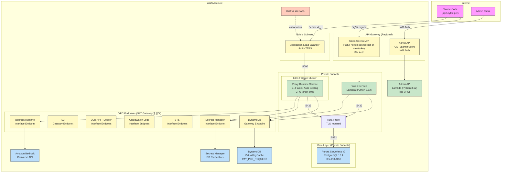

# Claude Code Proxy

Claude Code Proxy는 조직 SSO 기반 사용자 식별, Virtual Key 발급, 중앙 정책/쿼터 통제, Amazon Bedrock 호출을 하나의 경로로 묶기 위한 reference implementation입니다.  
클라이언트는 `apiKeyHelper`를 통해 단기 Virtual Key를 받고, 런타임은 Anthropic 호환 API 형태로 `/v1/messages`와 `/v1/messages/count_tokens`를 제공합니다.

이 저장소는 현재 다음 범위에 초점을 둡니다.

- 도메인 모델, 인증/인가, 정책, quota, usage/audit 흐름의 애플리케이션 로직
- pytest 기반 계약 테스트와 성능 계약 테스트
- AWS 배포 토폴로지를 재현하는 CDK stack/construct
- 초기 PostgreSQL schema 정의와 migration revision

실제 운영 환경에 바로 배포하기 전에는 몇 가지 교체 작업이 필요합니다.

- CDK의 Token Service Lambda와 ECS runtime container는 현재 인프라 contract test를 위한 placeholder code/image를 사용합니다.
- `infra/config.py`의 domain, ACM certificate, WAF ARN 기본값은 placeholder입니다. 실제 배포 시 환경 변수로 덮어씁니다.
- ECS runtime 이미지는 NAT 없는 isolated subnet 배치를 전제로 하므로, 실제 배포 시 private ECR 이미지가 필요합니다.
- Alembic revision 파일은 포함되어 있지만, `alembic.ini`와 runtime migration runner는 아직 이 저장소에 포함되어 있지 않습니다.

## 프로젝트 개요

시스템은 네 계층으로 구성됩니다.

1. Client Layer
   `scripts/api_key_helper.sh`가 AWS SSO 세션을 사용해 Token Service에서 Virtual Key를 받고 로컬 cache에 저장합니다.
2. Identity / Bootstrap Layer
   API Gateway + Lambda 기반 Token Service가 IAM Auth와 SigV4를 사용해 호출자를 식별하고 Virtual Key를 재사용 또는 발급합니다.
3. Proxy Runtime Layer
   FastAPI 기반 Proxy가 Bearer Virtual Key를 검증하고 정책, quota, rate limit을 평가한 뒤 Bedrock adapter를 호출합니다.
4. Data Layer
   Aurora PostgreSQL은 source of truth, DynamoDB는 Token Service cache 역할을 담당합니다.

## 배포 아키텍처

`cdk deploy`가 완료되면 다음과 같은 AWS 리소스가 생성됩니다.



### 보안 그룹 흐름

```
ALB (AlbSG)  ──TCP 443──▶  Internet
     │
     │ TCP 8000
     ▼
ECS (RuntimeServiceSG)  ──TCP 5432──▶  RDS Proxy (DatabaseProxySG)  ──TCP 5432──▶  Aurora (DatabaseSG)
                                              ▲
Token Service Lambda (TokenServiceSG)  ───────┘
     TCP 5432
```

### CloudFormation Outputs

| Output | 설명 |
|--------|------|
| `TokenServiceEndpointUrl` | Token Service의 `get-or-create-key` endpoint 전체 URL |
| `RuntimeEndpointUrl` | Proxy Runtime ALB의 HTTPS endpoint |
| `RuntimeAlbDnsName` | ALB DNS name |
| `RuntimeHttpsListenerArn` | HTTPS listener ARN |

## 주요 기능

| 기능 | 설명 |
|------|------|
| SSO 부트스트랩 | `apiKeyHelper`가 AWS SSO 임시 자격증명으로 Token Service를 SigV4 서명 호출 |
| Virtual Key 생명주기 | cache hit 시 재사용, miss 시 원장 재조회, 필요할 때만 새 키 발급 |
| Anthropic 호환 런타임 API | `POST /v1/messages`, `POST /v1/messages/count_tokens`, `GET /health`, `GET /ready` 제공 |
| 정책/쿼터/속도 제한 | 인증 이후 Bedrock 호출 전에 fail-closed 방식으로 평가 |
| 감사/사용량 추적 | usage/audit 저장 구조와 request_id 기반 최소 observability hook 포함 |
| Admin/API 운영 경계 | 사용자 등록, Virtual Key revoke/rotate/disable, budget policy, model mapping, cache invalidation 흐름을 테스트로 고정 |
| AWS IaC | 단일 `ClaudeCodeProxyStack` 아래에 VPC, Aurora, RDS Proxy, DynamoDB, API Gateway, Lambda, ALB, ECS Fargate, IAM, WAF, 기본 로그/메트릭 구성 선언 |
| 성능 계약 테스트 | local cache hit, Token Service cache hit, streaming first event latency에 대한 lightweight probe 제공 |

## 개발 환경 준비 및 배포

### 요구사항

- Python 3.11+
- AWS CLI v2
- AWS SSO를 사용할 수 있는 AWS 계정/프로파일
- AWS CDK CLI
- `jq`
- `cdk synth` 또는 `cdk deploy`를 사용할 경우 Node.js 환경

### 설치

가상환경을 먼저 만드는 흐름을 기준으로 사용하세요.

```bash
python -m venv .venv
source .venv/bin/activate
python -m pip install --upgrade pip
python -m pip install -e ".[dev]"
```

### 기본 검증

```bash
pytest -q
cdk synth
```

특정 범위만 빠르게 확인하려면 다음 명령을 사용할 수 있습니다.

```bash
pytest tests/api -q
pytest tests/token_service -q
pytest tests/observability/test_request_id_and_metrics.py -q
pytest tests/perf/test_contracts.py -q
```

### 0. 가장 쉬운 방법: shell 배포 스크립트

처음 배포할 때는 수동으로 환경 변수를 export하고 `cdk` 명령을 따로 치기보다 아래 shell 스크립트를 먼저 사용하는 편이 쉽습니다.

```bash
source .venv/bin/activate
scripts/deploy_claude_code_proxy.sh
```

스크립트는 shell script이며, AWS CLI와 CDK CLI를 직접 조합해서 다음 순서로 진행합니다.

1. `AWS profile`
2. 해당 profile로 `aws sts get-caller-identity` 실행
3. `AWS region`, logical environment name, ACM certificate ARN, WAF ARN 확인
4. runtime ECR repository name / image tag 확인 및 이미지 존재 여부 검증
5. `cdk synth`
6. `cdk deploy`
7. 선택 시 `api_key_helper.sh`를 `~/.claude/claude-code-proxy/` 아래에 설치
8. 선택 시 `~/.claude/settings.json`에 `apiKeyHelper`, `ANTHROPIC_BASE_URL`, `CLAUDE_CODE_PROXY_TOKEN_SERVICE_URL`, `AWS_PROFILE`, `AWS_REGION` 반영

추가 동작:

- 자격 증명이 없으면 `aws sso login --profile ...`를 실행하라는 안내만 출력하고 종료합니다.
- helper 설치를 선택하면 Claude Code가 실제로 사용할 shell helper 경로와 user settings를 함께 맞춥니다.
- 배포 후 stack output에서 runtime endpoint와 token service endpoint를 읽어 Claude 설정에 반영합니다.

### 1. 환경 분리 모델

환경 분리는 **AWS 계정 단위를 전제**로 합니다. 이 저장소에는 특정 환경에 대한 하드코딩된 설정이 없습니다. 배포자가 적절한 AWS 자격증명(`AWS_PROFILE`)으로 배포하는 것만 확인하면 됩니다.

- **account / region**: 배포 시 사용하는 AWS 자격증명에서 자동으로 결정됩니다 (`CDK_DEFAULT_ACCOUNT`, `CDK_DEFAULT_REGION`).
- **environment name**: stack name, API stage name 같은 리소스 이름 suffix로만 사용됩니다.

environment 이름 결정 우선순위:

1. CDK context `envName` (`-c envName=...`)
2. `CLAUDE_CODE_PROXY_ENV` 환경 변수
3. `AWS_PROFILE` 환경 변수
4. 모두 없으면 `dev`

environment 이름은 정규화됩니다: 소문자로 변환되고, 영숫자와 하이픈 이외의 문자는 하이픈으로 치환되며, 연속된 하이픈은 하나로 축소됩니다. 예를 들어 `My_Sandbox`는 `my-sandbox`가 됩니다.

가장 단순한 사용법:

```bash
source .venv/bin/activate
export AWS_PROFILE="my-sandbox"
export AWS_REGION="ap-northeast-2"
```

이 경우 AWS 자격증명은 `my-sandbox` profile에서, environment 이름도 `my-sandbox`가 됩니다.

environment 이름만 따로 지정하고 싶으면:

```bash
export AWS_PROFILE="my-sandbox"
cdk synth -c envName=team-alpha
```

### 2. 배포 설정 값 수정

실제 배포 전에는 아래 값을 환경 변수로 지정해야 합니다.

- Runtime domain / hosted zone
- ACM certificate ARN
- WAF ARN
- private ECR runtime image repository / tag

environment 이름을 기반으로 다음 기본값이 생성됩니다.

- stage name: `<env-name>`
- admin stage name: `admin-<env-name>`
- hosted zone: `<env-name>.example.internal`
- runtime domain: `proxy.<hosted-zone>`

환경 변수로 덮어쓸 수 있습니다.

- `CLAUDE_CODE_PROXY_HOSTED_ZONE_NAME`
- `CLAUDE_CODE_PROXY_DOMAIN_NAME`
- `CLAUDE_CODE_PROXY_CERTIFICATE_ARN`
- `CLAUDE_CODE_PROXY_WAF_ARN`
- `CLAUDE_CODE_PROXY_RUNTIME_IMAGE_REPOSITORY_NAME`
- `CLAUDE_CODE_PROXY_RUNTIME_IMAGE_TAG`

### 3. 실제 런타임 아티팩트 연결

현재 CDK construct는 토폴로지 검증을 위해 placeholder 구현을 사용합니다.

- `infra/constructs/token_service_construct.py`
  현재 inline Lambda handler는 상태 확인용 placeholder입니다.
- `infra/constructs/proxy_runtime_construct.py`
  현재 ECS container는 `python -m http.server` placeholder를 private ECR image로 올려두었다는 전제에서 동작합니다.

NAT를 두지 않고 `PRIVATE_ISOLATED` subnet + VPC endpoint만 사용하므로, runtime image는 `public.ecr.aws`가 아니라 같은 account/region의 private ECR repository에 있어야 합니다.

실제 배포 전에는 이 부분을 애플리케이션 패키지/컨테이너 이미지로 교체해야 합니다.

### 4. CDK synth / deploy

이 저장소의 `cdk.json`은 공용 app entry만 가집니다.

```json
{
  "app": "python -m infra.app"
}
```

개인별 environment 이름까지 저장소 `cdk.json`에 넣으면 팀 전체 기본값이 고정되기 때문에, 개인 설정은 보통 다음 둘 중 하나로 다룹니다.

- 실행 시 `-c envName=...` 사용
- 사용자 홈의 `~/.cdk.json`에 local context 저장

예시:

```json
{
  "context": {
    "envName": "my-sandbox"
  }
}
```

가장 쉬운 흐름:

```bash
source .venv/bin/activate
export AWS_PROFILE="my-sandbox"
export AWS_REGION="ap-northeast-2"

cdk synth
cdk deploy ClaudeCodeProxyStack
```

environment 이름을 명시하고 싶으면:

```bash
cdk synth -c envName=team-alpha
cdk deploy ClaudeCodeProxyStack -c envName=team-alpha
```

또는 Python app 인자로도 지정할 수 있습니다.

```bash
cdk synth -- --env-name team-alpha
cdk deploy ClaudeCodeProxyStack -- --env-name team-alpha
```

`scripts/deploy_claude_code_proxy.sh`는 배포 후 CloudFormation output(`RuntimeEndpointUrl`, `TokenServiceEndpointUrl`)을 자동으로 읽어 Claude Code 설정에 반영합니다.

### 5. 데이터베이스 schema 반영

초기 revision 파일은 `alembic/versions/20260329_000001_initial_schema.py`에 포함되어 있습니다.  
현재 저장소에는 Alembic runtime 설정 파일이 없으므로, 운영 환경에서는 기존 Alembic 체계에 이 revision을 연결하거나 동일 schema를 기준으로 migration runner를 구성해야 합니다.

## 배포 후 사용 방법

### 1. `apiKeyHelper`로 Virtual Key 받기

필수 환경 변수:

- `CLAUDE_CODE_PROXY_TOKEN_SERVICE_URL` (또는 fallback `TOKEN_SERVICE_URL`)
- `AWS_REGION` 또는 `AWS_DEFAULT_REGION`
- 필요 시 `AWS_PROFILE`

선택 환경 변수:

- `CLAUDE_CODE_PROXY_CACHE_PATH` — 캐시 파일 경로 (기본값: `~/.claude-code-proxy/cache.json`)
- `CLAUDE_CODE_PROXY_CACHE_TTL_SECONDS` — 캐시 TTL, 300–900초 (기본값: `300`)
- `CLAUDE_CODE_PROXY_REQUEST_TIMEOUT_SECONDS` — Token Service 요청 타임아웃 (기본값: `2`)

예시:

```bash
export CLAUDE_CODE_PROXY_TOKEN_SERVICE_URL="https://token-service.example.com/token-service/get-or-create-key"
export AWS_REGION="ap-northeast-2"
export AWS_PROFILE="my-sso-profile"

scripts/api_key_helper.sh
```

`scripts/api_key_helper.sh`는 standalone shell script입니다. 저장소의 Python runtime이나 virtualenv에 의존하지 않고 `aws`, `curl`, `jq`만으로 동작하도록 구성했습니다.

동작 방식:

1. `~/.claude-code-proxy/cache.json`에서 유효한 Virtual Key를 먼저 찾습니다.
2. cache miss면 `aws configure export-credentials --format env`로 임시 자격증명을 가져옵니다.
3. 자격증명 export에 실패하면 `aws sso login --profile ...`를 안내하며 종료합니다.
4. Token Service를 SigV4로 호출해 Virtual Key를 받습니다.

### 2. Proxy Runtime 호출

non-streaming 요청 예시:

```bash
curl -X POST "https://proxy.example.com/v1/messages" \
  -H "Authorization: Bearer vk_example_value" \
  -H "Content-Type: application/json" \
  -d '{
    "model": "claude-sonnet-4-5",
    "messages": [
      {"role": "user", "content": "Hello"}
    ]
  }'
```

token count 요청 예시:

```bash
curl -X POST "https://proxy.example.com/v1/messages/count_tokens" \
  -H "Authorization: Bearer vk_example_value" \
  -H "Content-Type: application/json" \
  -d '{
    "model": "claude-sonnet-4-5",
    "messages": [
      {"role": "user", "content": "Count these tokens"}
    ]
  }'
```

health check:

```bash
curl "https://proxy.example.com/health"
curl "https://proxy.example.com/ready"
```
